# Projeto - DEMODAY - Apresentação do IQfome

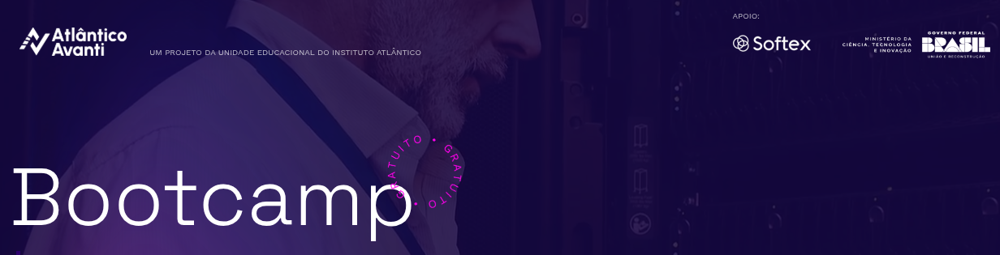

<p align="center">
	
	
	
	
</p>

Este repositório contém a aplicação api-refeicoes-aleatorias, desenvolvida em Python, com FastAPI elaborada por nós junto com uma pipeline de CI/CD automatizada usando o GitHub Actions. O objetivo é garantir entregas consistentes, testadas e com provisionamento de infraestrutura automática usando Terraform na plataforma Koyeb.

## Tecnologias Utilizadas
- **Python 3**

- **Docker**

- **Terraform**

- **GitHub Actions**

- **Koyeb**

- **Docker Hub**


## Sumário

---

## Pré-requisitos

- [Docker](https://docs.docker.com/engine/install/)
- [Terraform](https://www.terraform.io/)
- Conta no [GitHub](https://github.com/)
- Conta no [Terraform](https://terraform.io/)
- Conta no [Koyeb](https://www.koyeb.com/)
- Conta no [Docker Hub](https://hub.docker.com/)

---

## Arquitetura do Projeto

### Front-End

```
[ Desenv. Local / GitHub ]
           │
           ▼
╔════════════════════════════════════════════════════════╗
║                    GitHub Actions CI/CD                ║
║--------------------------------------------------------║
║   1. Lint       → Node.js-ESLint                       ║
║   2. Test       → Node-js.Jest                         ║
║   3. Build      → Docker Buildx (multi-plataforma?)    ║
║   4. Push       → Docker Hub                           ║
║   5. Deploy     → Terraform Apply na Google Cloud      ║
║   6. Cleanup    → Terraform Destroy (manual)           ║
╚════════════════════════════════════════════════════════╝
           │
           ▼
╔══════════════════════╗      ╔══════════════════════════╗
║    Docker Hub        ║─────▶║  Run Cloud(Google Cloud) ║
║  leonildolinck/...   ║      ║   Container App Running  ║
╚══════════════════════╝      ╚══════════════════════════╝
                                      │
                                      ▼
                           https://<app>.a.run.app

```
### Back-End

```
[ Desenv. Local / GitHub ]
           │
           ▼
╔════════════════════════════════════════════════════════╗
║                    GitHub Actions CI/CD                ║
║--------------------------------------------------------║
║   1. Lint       → Ruff                                 ║
║   2. Test       → Pytest                               ║
║   3. Build      → Docker Buildx (x64)                  ║
║   4. Push       → Docker Hub                           ║
║   5. Deploy     → Terraform Apply na Koyeb             ║
║   6. Cleanup    → Terraform Destroy (manual)           ║
╚════════════════════════════════════════════════════════╝
           │
           ▼
╔══════════════════════╗      ╔══════════════════════════╗
║    Docker Hub        ║─────▶║   Koyeb (Infra Cloud)    ║
║  leonildolinck/...   ║      ║  Container App Running   ║
╚══════════════════════╝      ╚══════════════════════════╝
                                      │
                                      ▼
                           https://<app>.koyeb.app

```

## Estrutura do Projeto

```sh
└── Avanti-DevOps-Desafio-DEMODAY/
    ├── .github
    │   └── workflows
    │       ├── back-end.yaml
    │       ├── destroy-back-end.yaml
    │       ├── destroy-front-end.yaml
    │       └── front-end.yaml
    ├── LICENSE
    ├── README.md
    ├── back-end
    │   ├── CICD.trigger
    │   ├── Dockerfile
    │   ├── app
    │   │   ├── __init__.py
    │   │   ├── crud.py
    │   │   ├── database.py
    │   │   ├── main.py
    │   │   ├── models.py
    │   │   └── test_main.py
    │   ├── cardapio.db
    │   ├── infra
    │   │   ├── main.tf
    │   │   └── variables.tf
    │   └── requirements.txt
    ├── front-end
    │   ├── .gitignore
    │   ├── CICD.trigger
    │   ├── Dockerfile
    │   ├── README.md
    │   ├── eslint.config.js
    │   ├── index.html
    │   ├── infra
    │   │   ├── main.tf
    │   │   └── variables.tf
    │   ├── package-lock.json
    │   ├── package.json
    │   ├── postcss.config.js
    │   ├── public
    │   │   └── vite.svg
    │   ├── src
    │   │   ├── App.jsx
    │   │   ├── App.test.jsx
    │   │   ├── assets
    │   │   ├── index.css
    │   │   ├── main.jsx
    │   │   └── setupTests.js
    │   ├── tailwind.config.js
    │   └── vite.config.js
    ├── images
    │   └── banner.png
    └── screenshots
        └── 1.png
```


# 2. Estrutura do workflow CI/CD

Este repositório apresenta uma estrutura monorepo, para facilitar o controle de versões e centralizar todo o conteúdo, não sendo a melhor opção para um ambiente real de produção, onde a esteira teria problema ao receber diversos commits em paralelo.

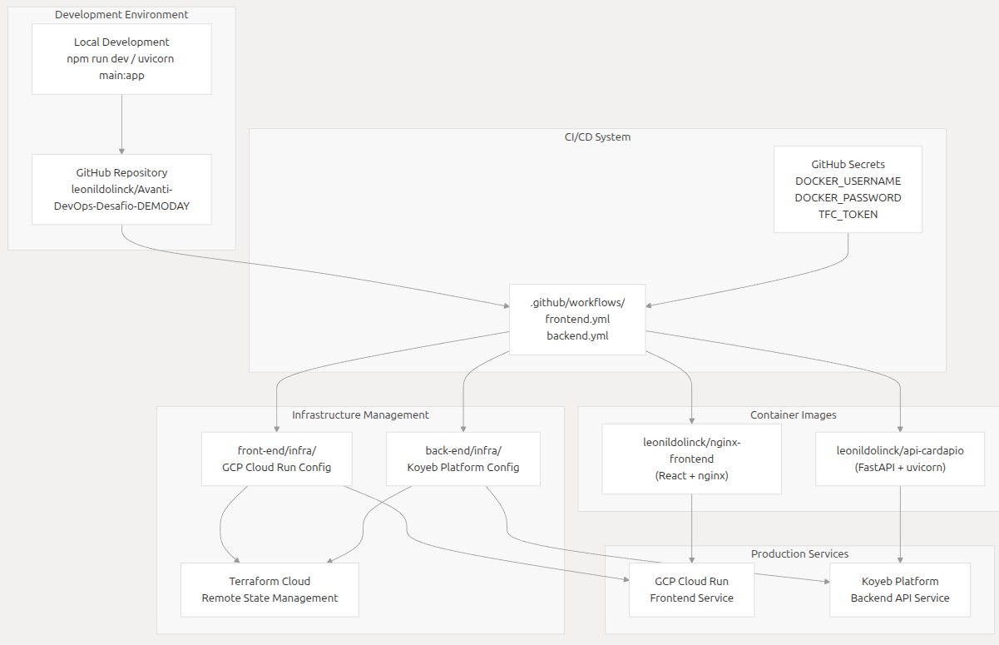

> Nota-se que o fluxo começa com o ambiente local de desenvolvimento, onde todas as alterações são enviadas ao repositório git, e a partir de então gatilhos são disparados, dependendo de qual pasta foi alterada. 
> 
> O fluxo de front-end, começa com lint, testes unitários, build do container (nginx), push para o Docker Hub e deploy para a infraestrutura cloud (Google Cloud) usando o Terraform. 
> 
> Por sua vez, o fluxo de back-end também conta com lint, testes, build-and-push (Docker-Hub), e deploy para uma cloud diferente (Koyeb).


# 3. Infraestrutura

## Provisionamento
Com o intuito de aplicar os conhecimentos aprendidos durante o curso, criaremos duas aplicações containerizadas, Front-End e Back-End, sendo o Front-End desenvolvido em React e o Back-End em Python. O Front-End será hospedado no serviço Cloud Run do Google e o Back-End será hospedado no serviço Container App do Koyeb. Criar contas nesses ambientes será necessário para implementar este projeto.

# 3.1 - Front-End

## Testes

A aplicação Front-End rodará no framework Vite, e com testes ESLint e Vitest sendo aplicados no momento do deploy.

### Testes de qualidade do código - Lint

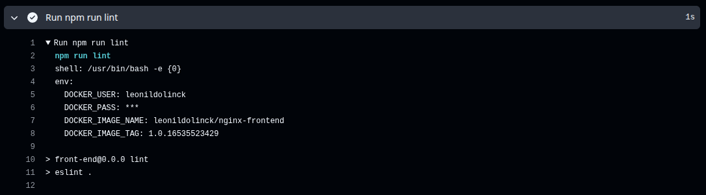

### Testes unitários - Vitest
 
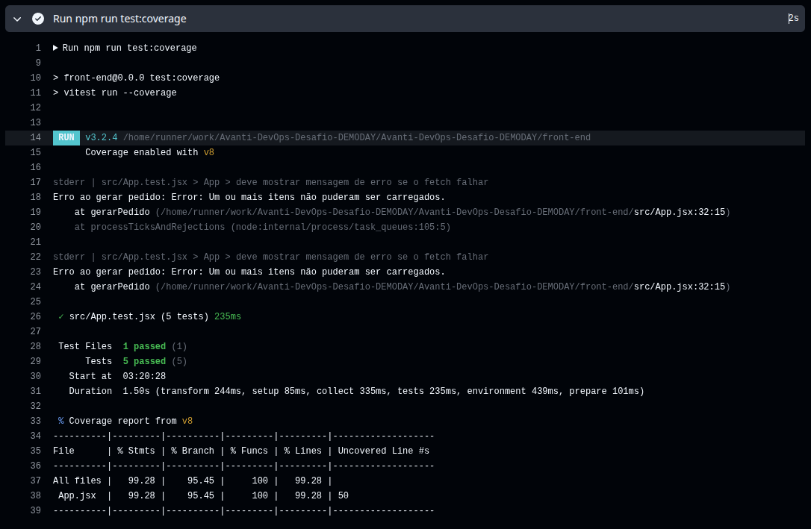

## Build

Com intuito de aplicar os conhecimentos aprendidos durante o curso, criaremos uma aplicação Front-End conteinerizada, rodando em uma imagem nginx e enviada para o repositório Docker Hub.

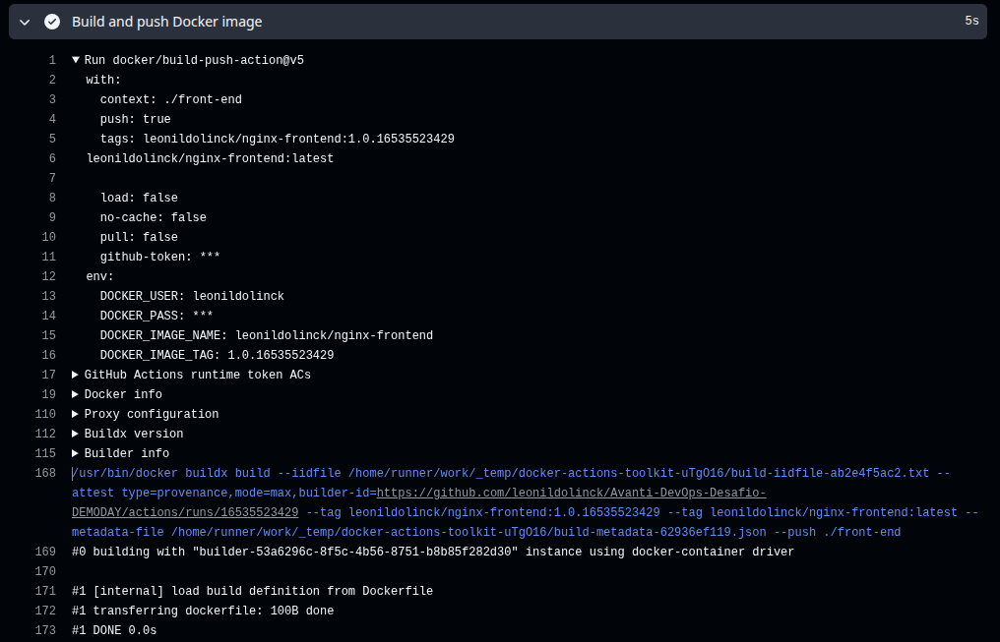

## Deploy

Após a imagem de container ser enviada para o respositório Docker Hub, é feito o deploy no serviço Cloud Run do Google.

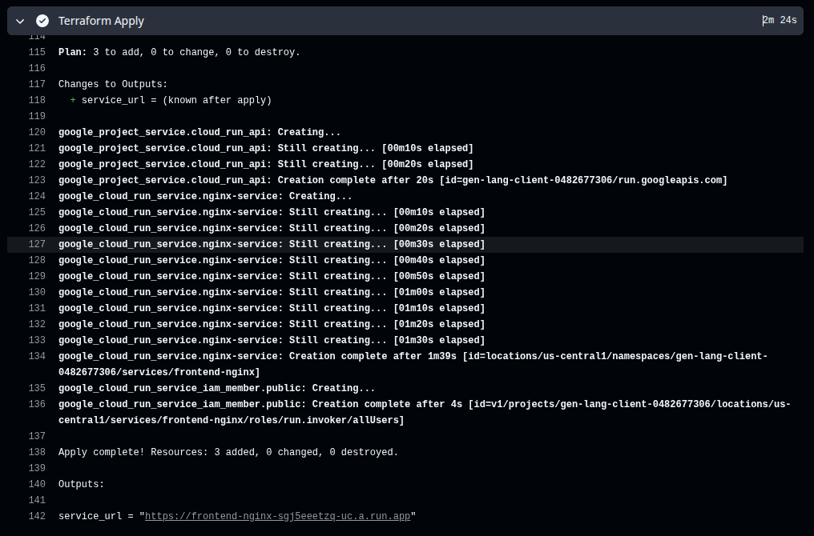


# 3.2 - Back-End

## Testes

A aplicação Back-End rodará no framework FastAPI, e com testes de código Ruff e unitários Pytest sendo aplicados no momento do deploy.

### Testes de qualidade do código - Ruff

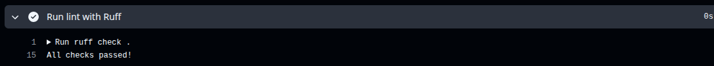

### Testes unitários - Pytest
 
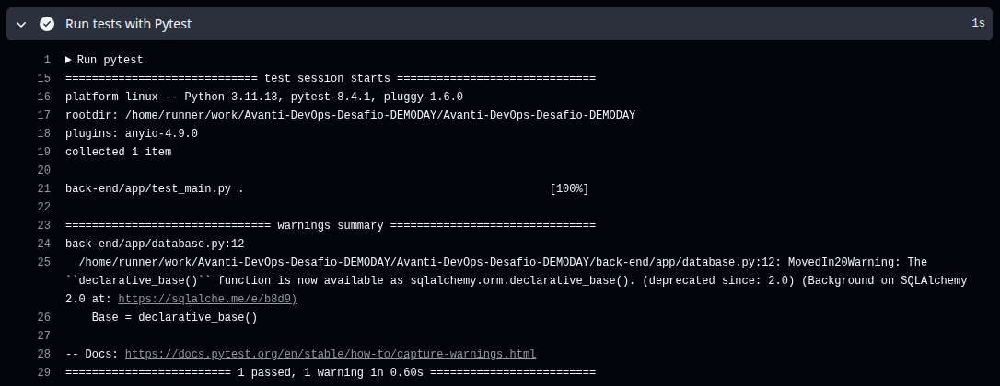

## Build

Do mesmo jeito que no Front-End, criaremos uma aplicação Back-End conteinerizada, rodando em uma imagem Docker e enviada para o repositório Docker Hub.

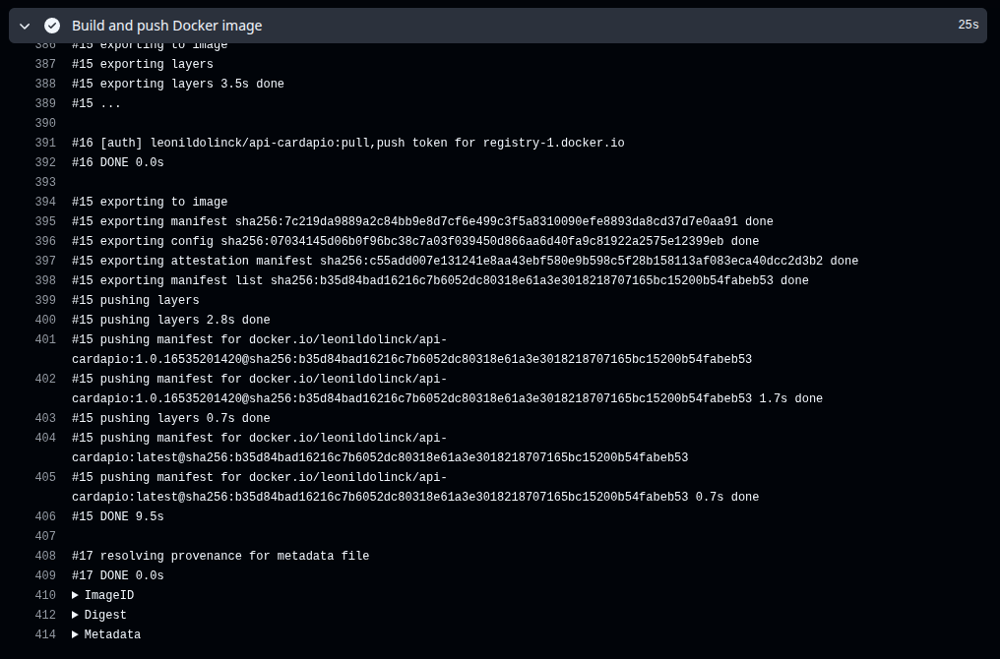

## Deploy

Após a imagem de container ser enviada para o respositório Docker Hub, é feito o deploy no serviço Cloud Run do Google.

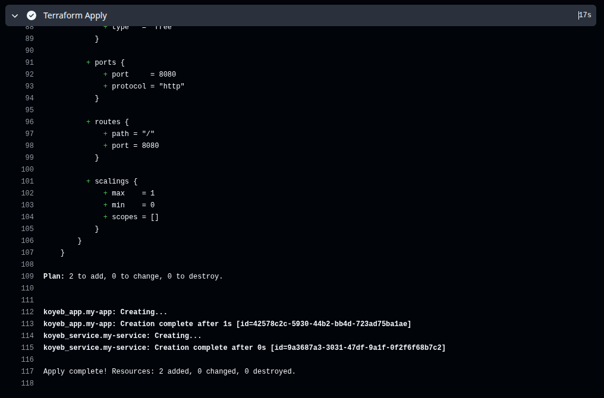

## 3.3 - Infraestrutura em funcionamento

### Google Cloud Run

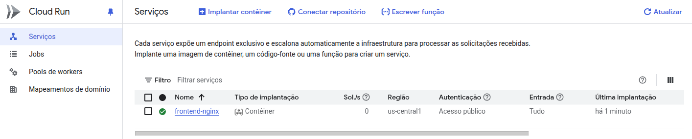

### Koyeb

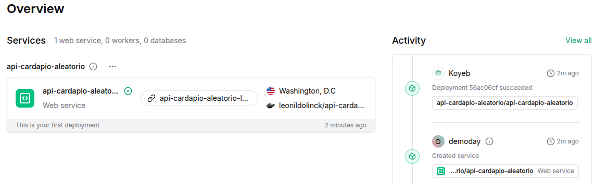

# 4. Resultado

Temos o site disponível, rodando em um container docker Nginx, e uma api que nos entrega nosso banco de dados via http, também em um container.


## Conclusão

Neste projeto, exploramos as etapas de uma esteira CI/CD no GitHub Actions, desde o provisionamento de infraestrutura até a criação e hospedagem de contêineres Docker no Docker Hub.

Este trabalho tem um objetivo educacional, aplicando as práticas aprendidas no BootCamp Avanti DevOps do Instituto Atlântico Avanti.

Sinta-se a vontade para fazer qualquer comentário ou sugestão!

## Contato

- **Email:** leonildolinck@gmail.com  
- **Discord:** leonildo  
- **LinkedIn:** [linkedin.com/in/leonildolinck](https://linkedin.com/in/leonildolinck)