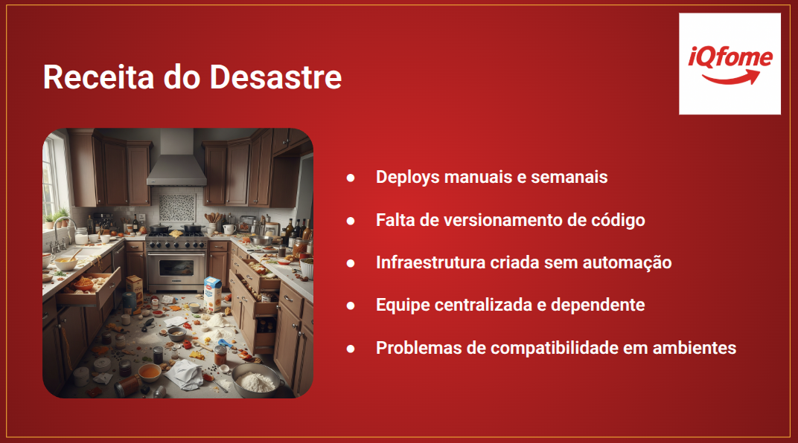
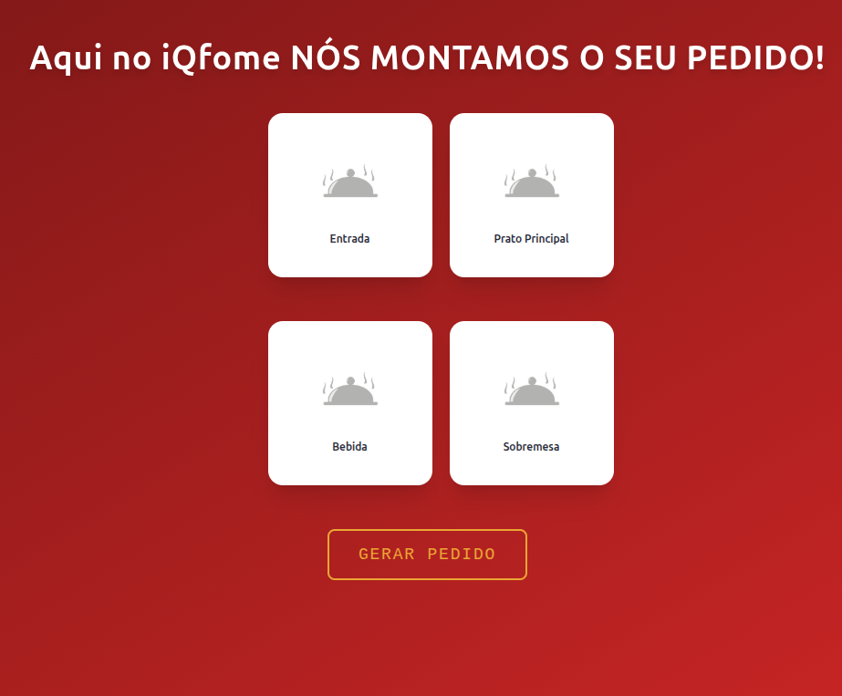

# Projeto - DEMODAY - Apresentação do IQfome


<p align="center">
	
	
	
	
</p>

Este repositório contém a aplicação `api-refeicoes-aleatorias`, desenvolvida em Python com FastAPI, junto com uma pipeline de CI/CD automatizada utilizando GitHub Actions. O objetivo é garantir entregas consistentes, testadas e com provisionamento de infraestrutura automatizado usando Terraform na plataforma Koyeb.

## Tecnologias Utilizadas
- **Python 3**
- **Docker**
- **Terraform**
- **GitHub Actions**
- **Koyeb**
- **Docker Hub**

## Sumário

- [Projeto - DEMODAY - Apresentação do IQfome](#projeto---demoday---apresentação-do-iqfome)
  - [Tecnologias Utilizadas](#tecnologias-utilizadas)
  - [Sumário](#sumário)
  - [Pré-requisitos](#pré-requisitos)
  - [Situação Problema](#situação-problema)
  - [Arquitetura do Projeto](#arquitetura-do-projeto)
    - [Front-End](#front-end)
    - [Back-End](#back-end)
  - [Estrutura do Projeto](#estrutura-do-projeto)
- [2. Estrutura do workflow CI/CD](#2-estrutura-do-workflow-cicd)
- [3. Infraestrutura](#3-infraestrutura)
  - [Provisionamento](#provisionamento)
    - [IaC - Google Cloud (Front-end)](#iac---google-cloud-front-end)
    - [IaC - Koyeb (Back-end)](#iac---koyeb-back-end)
- [3.1 - Front-End](#31---front-end)
  - [Testes](#testes)
    - [Testes de qualidade do código - Lint](#testes-de-qualidade-do-código---lint)
    - [Testes unitários - Vitest](#testes-unitários---vitest)
  - [Build](#build)
  - [Deploy](#deploy)
- [3.2 - Back-End](#32---back-end)
  - [Testes](#testes-1)
    - [Testes de qualidade do código - Ruff](#testes-de-qualidade-do-código---ruff)
    - [Testes unitários - Pytest](#testes-unitários---pytest)
  - [Build](#build-1)
  - [Deploy](#deploy-1)
  - [3.3 - Infraestrutura em funcionamento](#33---infraestrutura-em-funcionamento)
    - [Google Cloud Run](#google-cloud-run)
    - [Koyeb](#koyeb)
- [4. Resultado](#4-resultado)
  - [Conclusão](#conclusão)
  - [Contato](#contato)


## Pré-requisitos

- [Docker](https://docs.docker.com/engine/install/)
- [Terraform](https://www.terraform.io/)
- Conta no [GitHub](https://github.com/)
- Conta no [Terraform](https://terraform.io/)
- Conta no [Koyeb](https://www.koyeb.com/)
- Conta no [Docker Hub](https://hub.docker.com/)

---

## Situação Problema

Apresentamos um site fictício chamado iQFome, que é um gerador de refeições aleatórias inspirado no [Gerador de Saudações Aleatórias](https://github.com/leonildolinck/Avanti-DevOps-Desafio-3), abordado no Desafio 3.

Utilizaremos boas práticas DevOps, ferramentas e procedimentos modernos para resolver o problema proposto.




## Arquitetura do Projeto

### Front-End

```
[ Desenv. Local / GitHub ]
           │
           ▼
╔════════════════════════════════════════════════════════╗
║                    GitHub Actions CI/CD                ║
║--------------------------------------------------------║
║   1. Lint       → Node.js-ESLint                       ║
║   2. Test       → Node-js.Jest                         ║
║   3. Build      → Docker Buildx (multi-plataforma?)    ║
║   4. Push       → Docker Hub                           ║
║   5. Deploy     → Terraform Apply na Google Cloud      ║
║   6. Cleanup    → Terraform Destroy (manual)           ║
╚════════════════════════════════════════════════════════╝
           │
           ▼
╔══════════════════════╗      ╔══════════════════════════╗
║    Docker Hub        ║─────▶║  Run Cloud(Google Cloud) ║
║  leonildolinck/...   ║      ║   Container App Running  ║
╚══════════════════════╝      ╚══════════════════════════╝
                                      │
                                      ▼
                           https://<app>.a.run.app

```
### Back-End

```
[ Desenv. Local / GitHub ]
           │
           ▼
╔════════════════════════════════════════════════════════╗
║                    GitHub Actions CI/CD                ║
║--------------------------------------------------------║
║   1. Lint       → Ruff                                 ║
║   2. Test       → Pytest                               ║
║   3. Build      → Docker Buildx (x64)                  ║
║   4. Push       → Docker Hub                           ║
║   5. Deploy     → Terraform Apply na Koyeb             ║
║   6. Cleanup    → Terraform Destroy (manual)           ║
╚════════════════════════════════════════════════════════╝
           │
           ▼
╔══════════════════════╗      ╔══════════════════════════╗
║    Docker Hub        ║─────▶║   Koyeb (Infra Cloud)    ║
║  leonildolinck/...   ║      ║  Container App Running   ║
╚══════════════════════╝      ╚══════════════════════════╝
                                      │
                                      ▼
                           https://<app>.koyeb.app

```

## Estrutura do Projeto

```sh
└── Avanti-DevOps-Desafio-DEMODAY/
    ├── .github
    │   └── workflows
    │       ├── back-end.yaml
    │       ├── destroy-back-end.yaml
    │       ├── destroy-front-end.yaml
    │       └── front-end.yaml
    ├── LICENSE
    ├── README.md
    ├── back-end
    │   ├── CICD.trigger
    │   ├── Dockerfile
    │   ├── app
    │   │   ├── __init__.py
    │   │   ├── crud.py
    │   │   ├── database.py
    │   │   ├── main.py
    │   │   ├── models.py
    │   │   └── test_main.py
    │   ├── cardapio.db
    │   ├── infra
    │   │   ├── main.tf
    │   │   └── variables.tf
    │   └── requirements.txt
    ├── front-end
    │   ├── .gitignore
    │   ├── CICD.trigger
    │   ├── Dockerfile
    │   ├── README.md
    │   ├── eslint.config.js
    │   ├── index.html
    │   ├── infra
    │   │   ├── main.tf
    │   │   └── variables.tf
    │   ├── package-lock.json
    │   ├── package.json
    │   ├── postcss.config.js
    │   ├── public
    │   │   └── vite.svg
    │   ├── src
    │   │   ├── App.jsx
    │   │   ├── App.test.jsx
    │   │   ├── assets
    │   │   ├── index.css
    │   │   ├── main.jsx
    │   │   └── setupTests.js
    │   ├── tailwind.config.js
    │   └── vite.config.js
    ├── images
    │   └── banner.png
    └── screenshots
        └── 1.png
```


# 2. Estrutura do workflow CI/CD

Este repositório adota uma estrutura monorepo para facilitar o controle de versões e centralizar o conteúdo. Contudo, em ambientes reais, isso pode não ser ideal devido à alta frequência de commits concorrentes.


> O fluxo começa com o ambiente local, onde alterações são comitadas e, a partir disso, workflows específicos são acionados conforme a pasta alterada.
> 
> O pipeline do front-end executa lint, testes unitários, build com Docker, push para Docker Hub e deploy para o Google Cloud com Terraform.
> 
> O back-end segue fluxo semelhante, com deploy na plataforma Koyeb.


# 3. Infraestrutura

## Provisionamento
Com o intuito de aplicar os conhecimentos aprendidos durante o curso, criaremos duas aplicações containerizadas, Front-End e Back-End, sendo o Front-End desenvolvido em React e o Back-End em Python. O Front-End será hospedado no serviço Cloud Run do Google e o Back-End será hospedado no serviço Container App do Koyeb. Criar contas nesses ambientes será necessário para implementar este projeto.

```python
terraform {
  backend "remote" {
    organization = "leonildo-devops"

    workspaces {
      name = "avanti-frontend"
    }
  }

  required_providers {
    google = {
      source  = "hashicorp/google"
      version = "~> 5.0"
    }
  }
}
```
> Para contornar o problema de compartilhar artefatos entre os workflows no GitHub Actions, usaremos um back-end remoto para salvar os states do Terraform.

### IaC - Google Cloud (Front-end)

```python
provider "google" {
  project = var.gcp_project_id
  region  = var.gcp_region
}

resource "google_project_service" "cloud_run_api" {
  project = var.gcp_project_id
  service = "run.googleapis.com"

  disable_dependent_services = true
}

resource "google_cloud_run_service" "nginx-service" {
  name     = var.service_name
  location = var.gcp_region
```

### IaC - Koyeb (Back-end)

```python
provider "koyeb" {

}

resource "koyeb_app" "my-app" {
  name = var.app_name
}
```


# 3.1 - Front-End

## Testes

A aplicação Front-End rodará no framework Vite, e com testes ESLint e Vitest sendo aplicados no momento do deploy.

### Testes de qualidade do código - Lint


### Testes unitários - Vitest
 


## Build

Com intuito de aplicar os conhecimentos aprendidos durante o curso, criaremos uma aplicação Front-End conteinerizada, rodando em uma imagem nginx e enviada para o repositório Docker Hub.


## Deploy

Após a imagem de container ser enviada para o respositório Docker Hub, é feito o deploy no serviço Cloud Run do Google.


# 3.2 - Back-End

## Testes

A aplicação Back-End rodará no framework FastAPI, e com testes de código Ruff e unitários Pytest sendo aplicados no momento do deploy.

### Testes de qualidade do código - Ruff


### Testes unitários - Pytest
 


## Build

Do mesmo jeito que no Front-End, criaremos uma aplicação Back-End conteinerizada, rodando em uma imagem Docker e enviada para o repositório Docker Hub.


## Deploy

Após a imagem de container ser enviada para o respositório Docker Hub, é feito o deploy no serviço Cloud Run do Google.


## 3.3 - Infraestrutura em funcionamento

### Google Cloud Run

Servidor Web (Nginx) em funcionamento na plataforma Google.


### Koyeb

Servidor de API em funcionamento na plataforma Koyeb.


# 4. Resultado

Temos o site disponível, rodando em um container docker Nginx, e uma api que nos entrega nosso banco de dados via http, também em um container.




## Conclusão

Neste projeto, exploramos as etapas de uma esteira CI/CD no GitHub Actions, desde o provisionamento de infraestrutura até a criação e hospedagem de contêineres Docker no Docker Hub.

Este trabalho tem um objetivo educacional, aplicando as práticas aprendidas no BootCamp Avanti DevOps do Instituto Atlântico Avanti.

Sinta-se a vontade para fazer qualquer comentário ou sugestão!

## Contato

- **Email:** leonildolinck@gmail.com  
- **Discord:** leonildo  
- **LinkedIn:** [linkedin.com/in/leonildolinck](https://linkedin.com/in/leonildolinck)